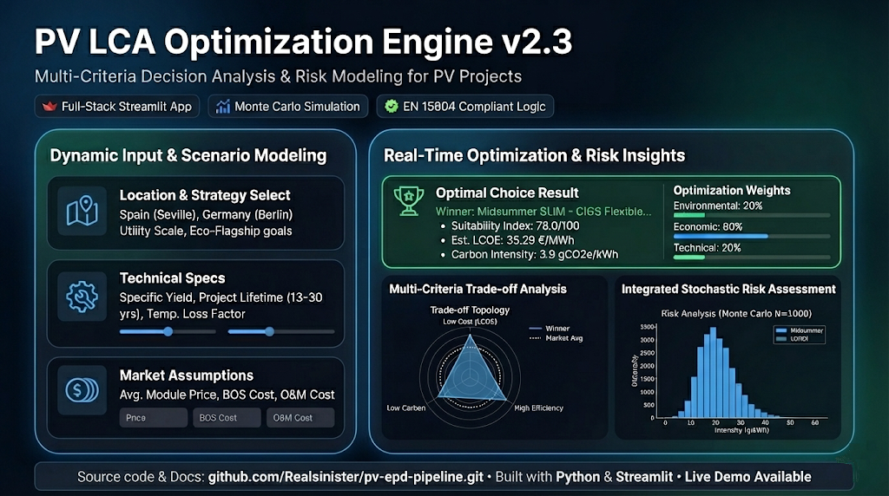
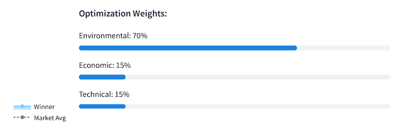
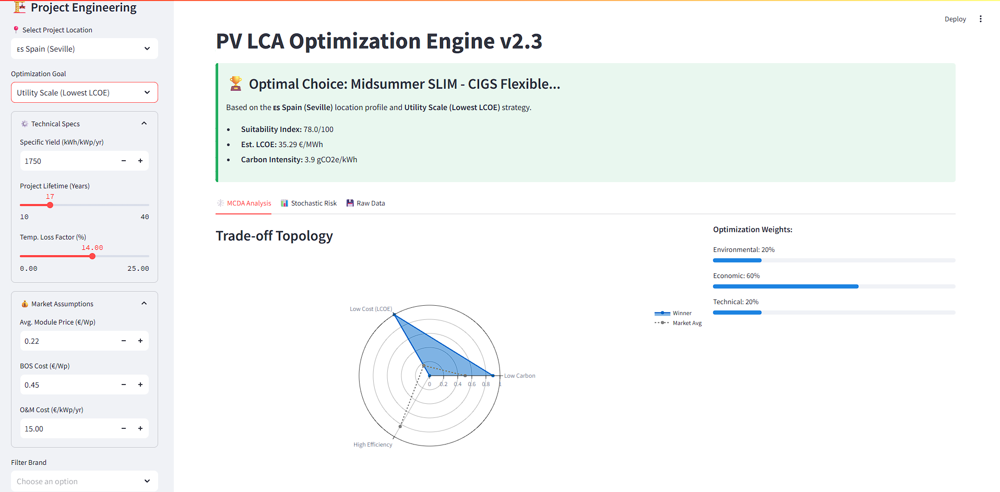
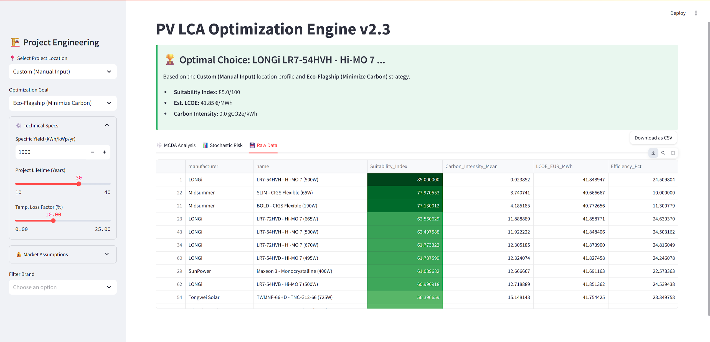

# PV LCA Optimization Engine v2.4
### Advanced EPD Analytics & Scenario Modeling for Renewable Infrastructure

---

## 🚀 Project Overview

The **PV LCA Optimization Engine** is a full-stack decision support tool designed to streamline the environmental assessment of photovoltaic (PV) projects. By bridging the gap between raw manufacturing specifications and strategic sustainability goals, this tool reduces complex assessment timelines by approximately **60%**.

It was engineered to solve data interoperability issues in the renewable sector, ingesting fragmented data from unorganized manufacturer PDFs and standardizing it into a normalized, search-ready asset aligned with **EPD Hub V3** and **EN 15804+A2** standards.

> **⚠️ Note on Code Access:** _This repository serves as a **technical portfolio and documentation archive**. The source code and raw datasets are **private** due to strict non-disclosure agreements (NDAs) regarding third-party environmental databases (Environdec). This entry demonstrates the tool's architecture, user interface, and analytical capabilities._

---

## 📸 Technical Walkthrough

### 1. Dynamic Parameter Configuration
The engine allows users to define project-specific parameters. Technical constraints (Yield, Lifetime, Temperature Loss) are dynamically adjusted against location-specific irradiation data to ensure accurate LCOE modeling.

| Location & Physics Inputs | Optimization Strategy Selection |
| :---: | :---: |
|  |  |
| *Defining site-specific physics (e.g., Berlin)* | *Selecting MCDA weights (Cost vs. Carbon)* |

### 2. Multi-Criteria Decision Analysis (MCDA)
The core engine visualizes the trade-offs between **Environmental Impact (GWP)**, **Economic Cost (LCOE)**, and **Technical Efficiency**.
The radar chart below displays the "Eco-Flagship" strategy, prioritizing low-carbon modules while monitoring cost competitiveness.

### 3. Automated Optimization & Results
Based on the selected strategy (e.g., *Utility Scale - Lowest LCOE*), the algorithm ranks 200+ modules and identifies the optimal hardware configuration. It calculates the specific **Carbon Intensity (gCO2e/kWh)** and **LCOE (€/MWh)** in real-time.

### 4. Stochastic Risk Analysis (Monte Carlo)
To account for supply chain variability and data uncertainty, the tool runs a **Monte Carlo simulation (N=1000)**. This provides a probability distribution of the Global Warming Potential (GWP), moving beyond static integers to risk-based reporting.

### 5. Data Transparency & Export
A normalized data table provides full transparency into the underlying EPD (Environmental Product Declaration) data, allowing engineers to audit the source values and export results to CSV for external reporting.

---

## ⚡ Key Features

### 🔧 Data Engineering & Architecture
* **Custom Data Import (New in v 2.4):** A seamless "Interoperability Layer" allowing consultants to inject proprietary project data (e.g., specific manufacturer bids) via CSV. The system automatically normalizes raw inputs, calculating implied Efficiency and LCOE for fair market comparison.
* **Automated Ingestion:** Python scripts with OCR capabilities to scrape and structure data from hundreds of unorganized manufacturer PDFs.
* **Normalization Logic:** Rigorous algorithms to convert inconsistent industry units (e.g., per panel vs. per m²) into standardized functional units (per kWh, per kWp).
* **Relational Database:** A normalized SQL schema managing 200+ turbine/module models and 80+ location profiles.

### 📊 Simulation Engine
* **Monte Carlo Simulation:** Integrated Python libraries (`numpy`, `scipy`) to perform stochastic analysis on environmental impact data.
* **LCOE & AEP Calculation:** Automated workflows for Annual Energy Production and Levelized Cost of Energy.
* **Compliance:** Calculation methodologies validated against ISO 14040/44 standards.

---

## 📈 Dashboard Capabilities

| Feature | Description |
| :--- | :--- |
| **Geo-Spatial Context** | Automatically adjusts energy yield and thermal loss factors based on project location (e.g., Spain vs. Sweden). |
| **Data Interoperability** | Users can download a standardized template, input their own private data, and merge it with the master database for benchmarking. |
| **Risk Analysis** | Visualizes the uncertainty of carbon data using probability histograms, exposing "greenwashing" risks in low-quality datasets. |

---

## 🛠️ Technical Stack

* **Core Logic:** Python (Pandas, NumPy, SciPy)
* **Web Framework:** Streamlit
* **Database:** PostgreSQL (Hosted on AWS RDS)
* **Visualization:** Plotly & Matplotlib
* **Version Control:** Git

---

## 🔒 License & Contact

**Copyright © 2025 [Yash Gupta]**
*The architectural design, logic, and interface concepts are the intellectual property of the author. Underlying environmental datasets are licensed from Environdec and cannot be redistributed.*

For technical inquiries or a live demonstration of the sanitized sandbox environment, please contact me via [LinkedIn](https://www.linkedin.com/in/yashjgupta).
