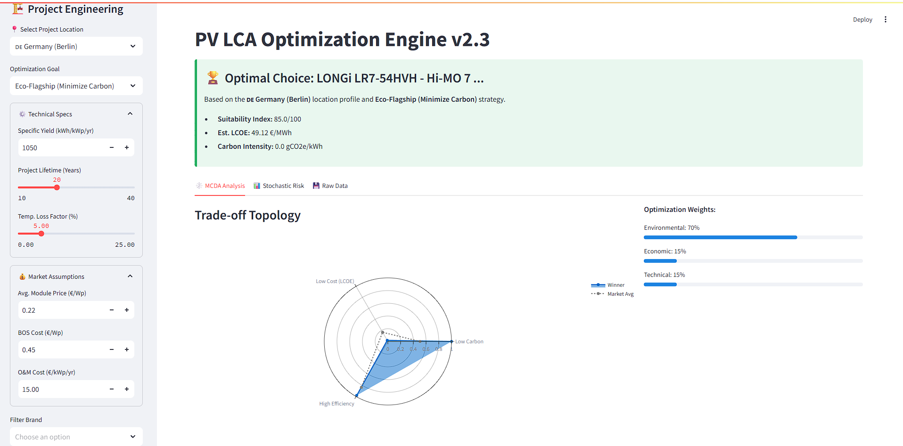
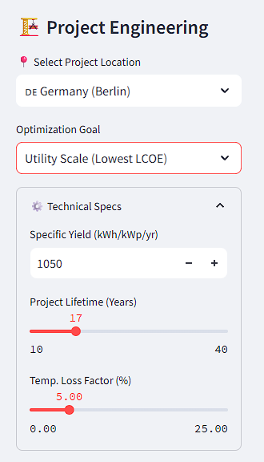
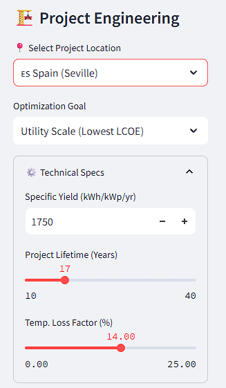
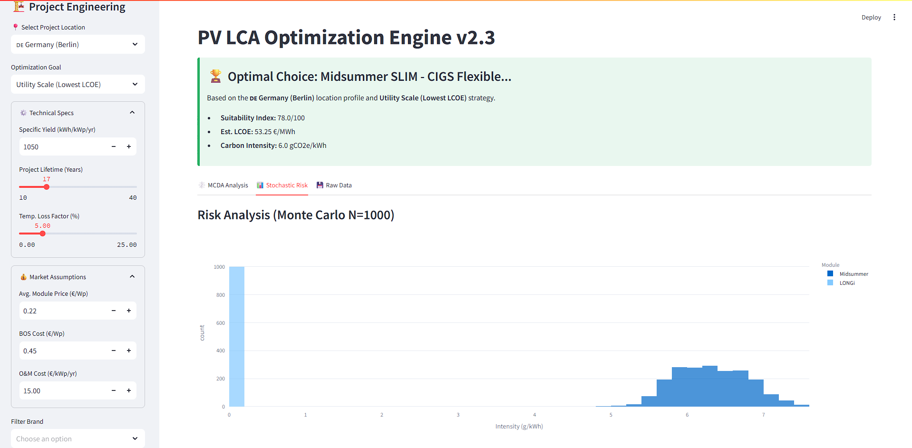

# PV LCA Optimization Engine v2.3 
### Advanced EPD Analytics & Scenario Modeling for Renewable Infrastructure

---

## 🚀 Project Overview

The **PV LCA Optimization Engine** is a full-stack decision support tool designed to streamline the environmental assessment of photovoltaic (PV) projects. By bridging the gap between raw manufacturing specifications and strategic sustainability goals, this tool reduces complex assessment timelines by approximately **60%**.

It was engineered to solve data interoperability issues in the renewable sector, ingesting fragmented data from unorganized manufacturer PDFs and standardizing it into a normalized, search-ready asset aligned with **EPD Hub V3** and **EN 15804+A2** standards.

> **Note:** This repository serves as a **technical portfolio and documentation archive**. The source code and raw datasets are **private** due to strict non-disclosure agreements (NDAs) regarding third-party environmental databases (Environdec).

---

## 📸 Interface & Capabilities

### 1. Main Dashboard & Scenario Modeling
*Real-time calculation of GWP (Global Warming Potential) based on project location, lifetime, and technical yield.*

### 2. Trade-off Topology
*Multi-criteria decision analysis comparing Economic (LCOE), Environmental (GWP), and Technical efficiency.*

### 3. Stochastic Risk Analysis (Monte Carlo)
*Probabilistic simulation (N=1000) to account for data uncertainty and supply chain variance.*

---

## ⚡ Key Features

### 🔧 Data Engineering & Architecture
* **Automated Ingestion:** Python scripts with OCR capabilities to scrape and structure data from hundreds of unorganized manufacturer PDFs.
* **Normalization Logic:** rigorous algorithms to convert inconsistent industry units (e.g., per panel vs. per m²) into standardized functional units (per kWh, per kWp).
* **Relational Database:** A normalized SQL schema managing 200+ turbine/module models and 80+ location profiles.

### 📊 Simulation Engine
* **Monte Carlo Simulation:** Integrated Python libraries (`numpy`, `scipy`) to perform stochastic analysis on environmental impact data.
* **LCOE & AEP Calculation:** Automated workflows for Annual Energy Production and Levelized Cost of Energy, validated against German governmental wind/solar data.
* **Compliance:** Calculation methodologies validated against ISO 14040/44 standards.

---

## 🛠️ Technical Stack

* **Core Logic:** Python (Pandas, NumPy, SciPy)
* **Web Framework:** Streamlit (Custom components for interactive charts)
* **Database:** PostgreSQL (Hosted on AWS RDS for development)
* **Visualization:** Plotly & Matplotlib
* **Version Control:** Git

---

## 🔒 License & Access

**Copyright © 2025 [Yash Gupta]**
*The architectural design, logic, and interface concepts are intellectual property of the author. Underlying environmental datasets are licensed from Environdec and cannot be redistributed.*

For technical inquiries or a live demonstration of the sanitized sandbox environment, please contact me via [LinkedIn](https://www.linkedin.com/in/yashjgupta).
